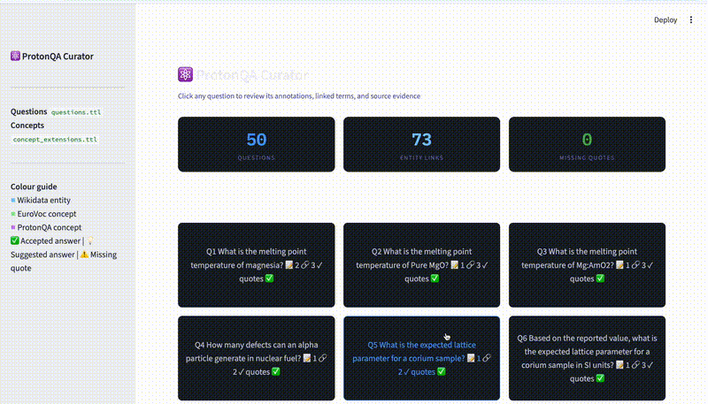
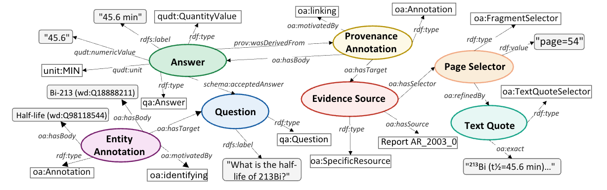

<p align="left">
  
</p>

A consolidated benchmark for Grounded Natural Language to QA on Technical Nuclear-related documents

[](https://creativecommons.org/licenses/by/4.0/)
[](https://doi.org/10.5281/zenodo.21346766)

## PROTON-QA Explorer

A visual demonstration of the PROTON-QA provenance model, illustrating how questions, answers, and evidence are linked to their source documents.

<p align="center">
  
</p>


## Overview

PROTON-QA is a knowledge-grounded benchmark for evaluating question answering systems over technical nuclear literature. The dataset comprises semantically annotated question–answer pairs derived from publicly available Action Reports published between 2000 and 2013 by the European Commission Joint Research Centre (JRC). Each question is linked to its source document, provenance metadata, ontology concepts, and unit-aware answer representations to support explainable and knowledge-grounded question answering.

PROTON-QA addresses four key gaps in existing domain-specific benchmarks:
1. Document provenance traceability for grounding questions and answers
2. Unit-aware numerical answer representation
3. Concept-level entity linking for semantic interoperability
4. Ontology-grounded representation enabling reasoning over diverse answer types

## Description of the Content

The source corpus consists of publicly available Action Reports published between 2000 and 2013 by the European Commission Joint Research Centre (JRC), Institute for Transuranium Elements (ITU), Karlsruhe. The reports describe experimental research in nuclear science and engineering, covering topics such as radiochemistry, nuclear materials, actinide and radionuclide characterization, fuel cycle research, waste management, analytical chemistry, and environmental studies. They include detailed experimental procedures, measurement results, technical analyses, tables, figures, and references, providing the technical evidence from which the benchmark's question–answer pairs and annotations were constructed.

## Naming Convention
Each document follows a three-part ID: `{type}_{YYYY}_{sequence}`

| Part       | Description                                                     |
|------------|-----------------------------------------------------------------|
| `type`     | `AR` (action report) |
| `YYYY`     | Full four-digit year (e.g., `2000` for 2000)                    |
| `sequence` | Sequence number within the same year (e.g., quarterly)          |

**Examples:**
- `AR_2000_0.pdf` — first action report of 2000

These IDs are used as URIs in the TTL knowledge files, e.g. `pqa:AR_2000_0`.

## Repository Structure

```
repo-root/
├── LICENSE                                # CC BY 4.0 License
├── croissant.jsonld                       # Croissant dataset metadata
├── croissant.ttl                          # Croissant metadata
├── README.md                              # Project documentation
│
├── corpus/                                # Documents (stored via Git LFS)
│   ├── AR_YYYY_seq.pdf                   # Action Reports (12 files)
│  
├── vocab/
│   ├── eurovoc_in_skos_core_concepts.rdf  # EuroVoc controlled vocabulary (SKOS)
│   ├── concept_extensions.ttl             # Custom nuclear domain concept extensions
│   ├── oa.ttl                             # Open Annotation (OA) ontology
│   ├── prov-o.ttl                         # PROV-O provenance ontology
│   ├── qanary.ttl                         # Qanary ontology for QA annotations
│   ├── schemaorg-current-http.ttl         # Schema.org vocabulary
│   ├── qudt.ttl                           # QUDT core ontology (quantities & dimensions)
│   └── qudt-unit.ttl                      # QUDT units vocabulary
│ 
├── benchmark/
│   ├── rag_prompt.md          # Prompt template for RAG systems
│   └── evaluate.py            # Benchmark evaluation script
│ 
└── questions.ttl                          # Q&A pairs with semantic annotations

```

## Naming Convention for URIs

| Entity                    | ID Pattern                       | Example                            |
|---------------------------|----------------------------------|------------------------------------|
| Question                  | `pqa:q{n}`                       | `pqa:q1`                           |
| Answer                    | `pqa:q{n}_a{m}`                  | `pqa:q1_a1`                        |
| Provenance annotation     | `pqa:q{n}_src{m}`                | `pqa:q1_src1`                      |
| Entity linking annotation | `pqa:q{n}_ann_{term}`            | `pqa:q1_ann_magnesia`              |
| Source document           | `pqa:{type}_{YYYY}_{seq}`        | `pqa:AR_2000_0`                    |


## Knowledge Files

### `questions.ttl`

The benchmark is represented as an RDF knowledge graph that integrates multiple semantic vocabularies. Each question is connected to its answers, source document, provenance, and semantic annotations through a structured graph.

<p align="center">
  
</p>

The knowledge model consists of the following components:

- **Question** (`qa:Question`) — represents a benchmark question and links to one or more answers through `schema:acceptedAnswer` or `schema:suggestedAnswer`.
- **Answer** (`qa:Answer`) — stores the answer text or numerical value together with unit-aware representations using QUDT.
- **Entity Annotation** (`oa:Annotation`) — links mentions in the question to ontology concepts (e.g., Wikidata, EuroVoc, or custom domain concepts).
- **Provenance Annotation** (`oa:Annotation`) — connects each answer to its supporting evidence in the source document using OA and PROV-O.
- **Evidence Source** (`oa:SpecificResource`) — identifies the referenced report.
- **Page Selector** (`oa:FragmentSelector`) — specifies the page containing the supporting evidence.
- **Text Quote** (`oa:TextQuoteSelector`) — records the exact supporting text extracted from the report.

The representation combines:

- **Schema.org** for questions and answers.
- **Open Annotation (OA)** for annotations and evidence linking.
- **PROV-O** for provenance.
- **QUDT** for numerical values and units.
- **Qanary** for question-answering concepts.
- **EuroVoc** and custom concept extensions for semantic entity linking.

### `concept_extensions.ttl`

Defines custom SKOS concepts for domain-specific terminology that is not sufficiently represented in existing vocabularies such as EuroVoc or Wikidata. These concepts include preferred labels, alternative labels, definitions, scope notes, and semantic links to related concepts.

**Example**

```turtle
pqa:MgAmO2 a skos:Concept ;
    skos:prefLabel  "Magnesium Americium Oxide"@en ;
    skos:altLabel   "Mg:AmO2"@en ;
    skos:definition "Mixture of magnesium oxide and americium dioxide used in nuclear fuel research."@en ;
    skos:scopeNote  "Studied in the context of actinide-doped oxide fuels."@en ;
    skos:relatedMatch wd:Q214769 ;   # Magnesium oxide (MgO)
    skos:relatedMatch wd:Q425412 ;   # Americium dioxide (AmO₂)
    skos:inScheme   pqa:ProtonQAVocabulary .
```

This representation extends existing vocabularies with nuclear-specific concepts while maintaining interoperability through SKOS semantic relations.

## Git LFS

The corpus documents are stored using **Git Large File Storage (Git LFS)**. To clone the repository with all PDF files:

```bash
git clone https://github.com/ARMADA-DN/Proton-QA.git
cd Proton-QA
git lfs pull
```

The following file types are managed via Git LFS:

- `*.pdf` — Source corpus documents

## Authors

| Name | Affiliation | Contact |
|------|-------------|---------|
| **Thushari Pahalage Dona** | University of Verona | <thushari.pahalage@univr.it> · [ORCID](https://orcid.org/0000-0001-6563-9516) |
| **Antonio Bulgheroni** | European Commission Joint Research Centre (JRC) | <Antonio.BULGHERONI@ec.europa.eu> · [ORCID](https://orcid.org/0000-0001-7988-2090) |
| **Lorenzo Fongaro** | European Commission Joint Research Centre (JRC) | <Lorenzo.FONGARO@ec.europa.eu> · [ORCID](https://orcid.org/0000-0001-9267-3525) |
| **Matteo Lissandrini** | University of Verona | <matteo.lissandrini@univr.it> · [ORCID](https://orcid.org/0000-0001-7922-5998) |

## Citation

If you use **PROTON-QA** in your research, please cite the dataset. If applicable, also cite the accompanying publication.

### BibTeX (Dataset)

```bibtex
@dataset{pahalage_dona2026protonqa,
  author    = {Thushari Pahalage Dona and
               Antonio Bulgheroni and
               Lorenzo Fongaro and
               Matteo Lissandrini},
  title     = {PROTON-QA: A Knowledge-Grounded Benchmark Dataset for Question Answering over Technical Nuclear Reports},
  year      = {2026},
  publisher = {Zenodo},
  doi       = {10.5281/zenodo.21346766},
  url       = {https://doi.org/10.5281/zenodo.21346766}
}
```

### BibTeX (Publication)

*To be added upon publication.*

## License

The PROTON-QA dataset is licensed under the
**Creative Commons Attribution 4.0 International (CC BY 4.0)**.

You are free to share and adapt the dataset for any purpose, provided
appropriate attribution is given.

See the [LICENSE](LICENSE) file or visit
https://creativecommons.org/licenses/by/4.0/ for the full license text.

## Benchmark Resources

The `benchmark/` directory contains the resources required to reproduce evaluations on the PROTON-QA benchmark.

- [`benchmark/rag_prompt.txt`](benchmark/rag_prompt.txt) — Prompt template for Retrieval-Augmented Generation (RAG) systems.
- [`benchmark/evaluate.py`](benchmark/evaluate.py) — Evaluation script for comparing system outputs against the reference RDF annotations and computing benchmark metrics.
